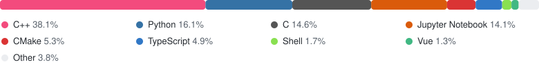

# OrbitZore

**Compiler & Operator Developer · LLM Inference & Agents**

---

## 🧑‍💻 About Me

- 🔭 Working on **LLM inference & AI infrastructure** at `EVAS Intelligence Co.,Ltd`
- 🧠 Deep into **compilers (LLVM / RISC-V)**, **AI Operators**, **KV Cache**, **MoE architectures** & **Agent systems**
- 📝 I write about compilers and LLM internals on my blog → [**z3475.work**](https://z3475.work)
- 💬 Ask me about **C++**, **LLVM**, **CUDA operators**, **LLM serving**
- 🏆 ICPC competitor, ACM problem setter mindset
- ⚡ *Forward to AGI.*

## 🚀 Selected Projects

| Project | What it does |
| --- | --- |
| 🕸️ [**pcl**](https://github.com/OrbitZore/pcl) | Prompt Control Language — a template DSL for orchestrating LLM agents |
| 🏔️ [**gitmount**](https://github.com/OrbitZore/gitmount) | Browse every git branch, tag and commit as a read-only filesystem (C++) |
| 🐍 [**MCP-WASMPython-Runner**](https://github.com/OrbitZore/MCP-WASMPython-Runner) | A safe sandboxed MCP Python runner with Docker |
| ⚡ [**libzio**](https://github.com/OrbitZore/libzio) | Coroutine library built on C++20 coroutines + io_uring |
| 🌐 [**HNUSTnet**](https://github.com/OrbitZore/HNUSTnet) | Campus network auto-connect tool (C++) |
| 📚 [**ATL**](https://github.com/OrbitZore/ATL) | Algorithm template library for ACM/ICPC |

## 📝 Latest Blog Posts

<!-- BLOG-POST-LIST:START -->
- 📝 [LLVM RISC-V 后端：从 IR 到 MIR 再到汇编](https://z3475.work/reborn/2026/09/13/LLVM-RISC-V%E5%90%8E%E7%AB%AF/) — 2026-09-13
- 📝 [LLVM IR 中端 Pass 的设计目标与运行原理](https://z3475.work/reborn/2026/09/13/LLVM-IR%E4%B8%AD%E7%AB%AFPass%E8%AE%BE%E8%AE%A1%E4%B8%8E%E5%8E%9F%E7%90%86/) — 2026-09-12
- 📝 [Agent原理介绍](https://z3475.work/reborn/2026/09/02/Agent%E5%8E%9F%E7%90%86%E4%BB%8B%E7%BB%8D/) — 2026-09-02
- 📝 [KV Cache 笔记](https://z3475.work/reborn/2026/08/30/KVCache%E7%AC%94%E8%AE%B0/) — 2026-08-30
- 📝 [从llama2到Qwen3.5-MoE，再到DeepSeek-V4-Flash——架构变迁笔记](https://z3475.work/reborn/2026/08/29/%E6%9E%B6%E6%9E%84%E5%8F%98%E8%BF%81%E7%AC%94%E8%AE%B0/) — 2026-08-29<!-- BLOG-POST-LIST:END -->

> ↻ Auto-refreshed every 6 hours by [blog-post-workflow](https://github.com/gautamkrishnar/blog-post-workflow) · [📜 RSS](https://z3475.work/rss2.xml)

## 🛠️ Tech Stack

**Languages**

**Compilers & AI Infra**

**Toolchain & Platforms**

## 📊 GitHub Stats

 

 

 

## 🤝 Connect with Me

---

⭐ From [OrbitZore](https://github.com/OrbitZore) with 💙 · Last refreshed by GitHub Actions

